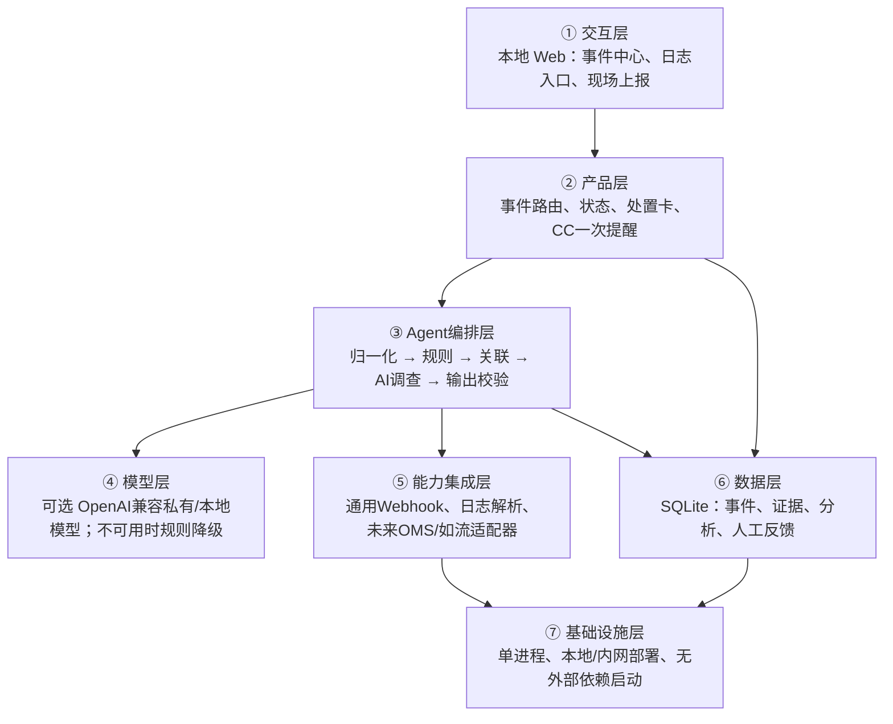

# IDC AI 故障调查与现场协同 MVP 设计

> 状态：已确认，待实现  
> 日期：2026-08-23  
> 依据：用户提供的 IDC 现场流程、OMS 截图与资料、Agent 产品架构蓝图、既有竞品研究

## 1. 产品目标

首版交付一个可在客户内网或单机运行的 Web 产品，将监控告警、日志和现场人员观察统一成故障事件，由 AI 辅助完成证据整理、事件关联、故障分类、影响判断和现场处置建议。

首版重点不是替代监控平台、OMS、如流或电话系统，而是在它们之间增加一个 AI 调查与协同层，减少人工翻日志、整理 SN、重复描述和来回确认的时间。

### 1.1 第一批用户

- 系统组/SIM：接收系统与服务器告警，判断是否需要现场介入。
- 网络组：接收链路、端口、模块和交换机告警，与现场联合排查。
- IDC 现场人员：确认设备、补充物理观察、执行经过确认的操作。
- 现场组长/协调人员：查看事件、影响范围和处理状态。

### 1.2 首版成功标准

- 一条告警、日志或现场上报在 10 秒内形成可查看的事件。
- 同一设备或同一故障的重复输入能够自动归入同一事件。
- 每个 AI 结论都显示对应证据；无证据时不得下确定性结论。
- 现场处置卡必须显示完整 SN 和机架位，不允许只显示 SN 尾号。
- 模型不可用时，事件接入、规则识别、页面查看和人工处理仍然可用。
- 四个内置回放场景均可完成“进入系统—分析—处置展示—解决关闭”的闭环。

## 2. 首版范围

### 2.1 三类输入入口

1. **通用告警接口**：接收监控平台通过 HTTP 推送的结构化告警。首版提供稳定的通用契约，不依赖某一家平台的账号或私有接口。
2. **日志入口**：浏览器上传文本日志或直接粘贴日志。首批识别 Linux 系统、内核、磁盘、内存、网络和应用运行日志中的常见异常。
3. **现场上报**：现场人员填写机房、完整 SN、机架位、设备名、观察现象和补充说明。未知字段可以留空，但系统必须显著提示缺失项。

### 2.2 核心输出

- 统一故障事件及简短状态：新发现、处理中、已解决。
- 故障类别：系统、硬件、网络、应用、动环或未知。
- 影响范围：单设备、多设备、机柜/列级或暂时未知。
- 关键证据和事件时间线。
- 根因候选、置信度、支持证据、反证和缺失信息。
- 面向接口人的故障摘要。
- 面向现场的处置卡。
- 可复制的沟通文本，不直接发送如流消息或创建 OMS 工单。

### 2.3 CC 边界

CC 是既有电话通报渠道，不是本产品的事故处理子系统。

- 产品只在识别到满足 CC 条件时给出一次醒目提醒：“请立即按现有 CC 流程拨打电话”。
- 不生成或管理第一报、第二报、第三报。
- 不管理通话步骤、接收人、录音、许可证、回执或后续催办。
- 产品可将“何时因何种证据产生过 CC 提醒”作为普通事件证据自动留痕。
- CC 提醒分支结束后，若事故仍需分析或现场操作，继续走正常故障调查流程；两者互不绑定。

### 2.4 明确不做

- 不重做日志存储平台、监控平台、OMS、资产系统、如流或电话系统。
- 不在首版接入真实 OMS/如流私有接口。
- 不远程关机、重启、改配置、清理文件或执行自动修复。
- 不读取客户源代码仓库，不扫描未知目录，不要求日志离开客户环境。
- 不做多 Agent 团队、复杂审批流、复杂超时催办或长期学习系统。

## 3. 核心业务流程

```text
告警接口 / 日志上传或粘贴 / 现场上报
                    │
                    ▼
          字段归一化、脱敏、时间校正
                    │
                    ▼
        规则识别与重复/关联事件合并
                    │
                    ▼
       AI 调查：分类、证据、影响、候选原因
                    │
                    ▼
              统一故障事件
        ┌───────────┼───────────┐
        ▼           ▼           ▼
    远程处理    需要现场介入   CC 条件满足
                    │           │
                    ▼           ▼
              现场处置卡    仅提醒拨打 CC
                    │
                    ▼
          人工更新处理中/已解决
```

事件合并优先使用确定性信息：机房、完整 SN、设备名、机架位、IP、告警签名、时间窗口和拓扑标签。AI 只补充语义判断，不得覆盖明确的设备身份。

## 4. 现场处置卡

处置卡是首版的关键交付物，字段如下：

- 机房名称与编码。
- 完整 SN。
- 机架位。
- 设备名、设备类型和管理 IP（已提供时）。
- UID 状态：已远程点亮、未点亮或未知。
- 操作电源风险：允许操作、禁止断电、需联系接口人确认或未知。
- OMS 的“是否从重装中发起”值（已提供时）。
- 接口人及来源团队（SIM/网络组/其他）。
- 当前证据和现场需要确认的最少项目。
- 建议动作、风险提示和停止条件。

任何可能影响供电、业务或资产的动作只以“建议/待确认”展示。身份、位置、电源权限不完整时，产品必须提示停止操作并联系接口人，不得由 AI 猜测。

## 5. 数据契约

三种入口先转换成统一输入对象：

```json
{
  "source": "monitor|log|onsite",
  "event_time": "ISO-8601",
  "site": "BJYZ",
  "severity": "info|warning|critical|unknown",
  "device": {
    "sn": "完整SN或空",
    "name": "设备名或空",
    "rack_position": "机架位或空",
    "device_type": "server|switch|facility|unknown",
    "ip": "可选"
  },
  "summary": "异常摘要",
  "raw_text": "日志或现场描述",
  "labels": {},
  "operation_context": {
    "from_reinstall": "yes|no|unknown",
    "uid_status": "on|off|unknown",
    "power_permission": "allowed|forbidden|confirm|unknown"
  }
}
```

事件对象保存输入来源、合并依据、证据引用、AI 分析、现场处置卡、状态和人工反馈。原始输入不可被 AI 输出覆盖或改写。

## 6. 分析策略

首版采用“规则先行，模型增强”，避免把所有原始日志直接交给大模型。

1. 规则层提取时间、设备身份、错误等级、故障关键词和已知模式。
2. 关联层按设备、位置、时间和异常签名合并事件，并识别多机共同事故候选。
3. AI 层只接收压缩后的证据包，输出结构化结论：类别、影响、候选原因、证据、反证、缺失信息和建议。
4. 输出校验层拒绝没有证据引用的确定性断言，并将其降级为“待确认”。

首批规则覆盖：

- 高温、温度持续上升、风扇转速异常和动环异常描述。
- 磁盘 I/O 错误、SMART/NVMe 异常、文件系统只读或空间不足。
- OOM、内存 ECC/MCE、内存条相关异常和异常重启。
- 网口 down、链路 flap、光模块/光功率/端口相关异常。
- 服务启动失败、端口冲突、进程崩溃和应用错误堆栈。

## 7. 页面设计

首版采用一个桌面优先、手机可用的轻量 Web 界面：

1. **事件中心**：顶部显示新发现、处理中、已解决数量；列表显示严重度、类别、机房、设备、摘要、影响数量和更新时间。
2. **新建/接入**：日志上传、日志粘贴、现场上报三个入口；通用告警接口在同页展示调用示例和最近接入记录。
3. **事件详情**：左侧为摘要、时间线和证据；右侧为根因候选、缺失信息和处置建议。
4. **现场处置卡**：在需要现场介入时置顶，身份和安全字段缺失时红色提示。
5. **CC 提醒**：只显示一次醒目的提醒条，不出现独立 CC 页面、步骤或状态机。

## 8. Agent 蓝图映射

### 8.1 Harness 五要素

| 要素 | 首版设计 |
|---|---|
| 工具 | 接收告警、读取用户提交日志、提取证据、查找事件、创建/更新事件、生成摘要 |
| 知识 | Linux/硬件/网络常见规则、用户提供的 IDC SOP、现场身份与操作约束 |
| 观察 | 原始告警/日志、人工输入、规则命中、事件合并依据、模型结构化输出、人工状态反馈 |
| 行动 | 创建和合并事件、展示提醒、生成处置卡和可复制文本；不执行基础设施写操作 |
| 权限 | 默认本地只读、数据白名单、敏感信息脱敏、模型外发显式开启、操作建议不等于执行授权 |

### 8.2 组件选型

- 使用：工具系统、权限检查点、钩子/审计、固定工作流、集成 Harness、目标输出校验。
- 暂不使用：子 Agent、Agent 团队、定时调度、复杂任务 DAG、自动执行动作和长期记忆。

## 9. 七层架构



安全边界和可观测性横跨全部层：每次输入、规则命中、事件合并、模型调用和人工修改均记录审计信息。

## 10. 技术形态

- Python 3.9+ 单进程服务，兼容当前机器的系统 Python。
- 使用标准库 HTTP 服务、JSON、SQLite 和日志组件，避免首版安装大型依赖。
- 前端使用原生 HTML、CSS 和 JavaScript，不引入前端构建链。
- 浏览器读取上传文件内容后以 JSON 提交，后端不需要 multipart 依赖。
- 可选模型适配器通过配置接入 OpenAI 兼容接口；默认不开启外部发送。
- 所有配置使用环境变量或本地配置文件，不把密钥写入代码或数据库。

## 11. 失败与降级

- 输入缺字段：创建事件但标记缺失信息，不猜测完整 SN、机架位或权限。
- 日志无法解析：保存原文，允许人工补充摘要，事件仍可继续处理。
- 模型不可用/超时：使用规则结论，并显示“AI增强暂不可用”。
- 重复输入：追加为同一事件的新证据，不重复创建处置任务。
- 关联不确定：保留独立事件并给出“可能相关”提示，不强制合并。
- 数据库写入失败：接口返回明确错误，不向用户显示保存成功。
- 可疑敏感内容：在模型调用前脱敏；外部模型未显式配置时不发送任何数据。

## 12. 验证方案

内置四个可重复回放场景：

1. 高温与多机风扇升高：识别共同影响范围；满足配置规则时只提示拨打 CC。
2. 磁盘 I/O/SMART 故障：定位设备和候选磁盘，生成禁止盲目断电的处置卡。
3. 内存 ECC/MCE：给出内存与主板候选，明确“更换内存未恢复不能证明原定位正确”。
4. 网络链路故障：区分本端、线缆/光纤、对端和端口候选，输出逐步只读/物理确认建议。

自动测试覆盖：

- 三种入口到统一契约的转换。
- 完整 SN 和机架位不被截断。
- 重复事件合并与不确定关联。
- CC 只产生一次提醒，不生成后续流程。
- 模型不可用降级。
- 敏感信息脱敏。
- 状态从新发现到处理中再到已解决。

## 13. 当日交付定义

当以下内容全部成立，首版才算可运行，而不是静态原型：

- 一条命令启动本地 Web 服务。
- 三种输入入口均可用。
- 事件中心、事件详情和现场处置卡可操作。
- 四个内置场景可一键回放。
- SQLite 可保存事件，重启服务后数据仍在。
- 没有模型密钥时仍可完整演示；配置模型后可获得 AI 增强结论。
- 有自动测试和简明启动说明。
