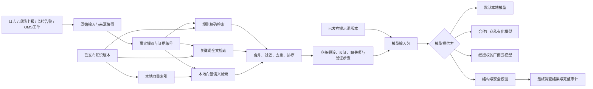

# IDC AI 运维平台：数据与 AI 资产、混合 RAG 及现场复核设计

日期：2026-08-24  
状态：已完成对话确认，等待用户审核书面设计

## 1. 目标

在现有 IDC AI 故障调查产品上增加一套用户可见、可维护、可审计的数据与 AI 资产管理能力，同时重新组织界面，使不同角色能直接找到自己的工作入口。

用户需要能够：

- 查看产品实际保存的事件、原始输入、事实、分析、工单、确认和操作记录。
- 新增、编辑、测试、发布和回滚故障经验。
- 查看并编辑 System 提示词、用户提示词模板、变量、输出契约和模型参数。
- 查看某次分析的完整 RAG 链路，包括输入、事实、检索请求、命中理由、模型输入、模型原始输出、校验和最终结果。
- 默认在现场使用本地模型和本地向量索引，同时保留未来接入合作模型厂商的统一接口。
- 将 OMS 工单、设备身份校验、接口人许可、现场操作和人工复核贯通为一条不可篡改的审计链。

产品布局可以重构，但现有能力和已有数据不得丢失。

## 2. 当前基础与迁移原则

当前产品已经具备：

- SQLite 事件数据库：`incidents`、`event_inputs`、`audit_log`、`facility_profiles`、`facility_profile_history`。
- 48 张 JSON 诊断知识卡和 12 个资料来源。
- 4 类提示词契约：事实提取、竞争假设、下一步验证和沟通整理。
- 规则与关键词驱动的可解释知识召回。
- 可选的大模型增强；模型不可用时能够退回规则与知识分析。
- 真实日志、现场上报、Webhook、模拟案例、数据源状态、机房等级、CC 判断、现场处置卡和可审计调查链。

迁移遵循以下原则：

1. 现有 SQLite 事件数据原样保留。
2. 48 张 JSON 知识卡迁移成数据库中的已发布初始版本，内容、来源和版本号不改变。
3. 现有提示词契约迁移成已发布初始版本；程序中写死的 System 提示词也迁移到提示词版本库。
4. 迁移前后的固定测试案例结果要能够对照；异常差异必须显式审核。
5. 原始 JSON 文件在迁移完成前保留为只读备份，不在运行时继续形成双写真源。

## 3. 非目标与边界

本阶段不包括：

- 由 AI 自动批准断电、重启、拔盘、拔线、更换部件或其他物理操作。
- 由 AI 替代接口人确认业务状态和操作许可。
- 在没有授权人的情况下自动放行紧急操作。
- 默认把客户原始日志发送到外部云模型。
- 在产品内实现 CC 后续电话通报流程；产品只负责识别和提醒进入既有 CC 流程。
- 首版直接内置电话呼叫许可证和运营商能力。
- 在未知 OMS、CMDB 或如流接口的情况下承诺生产级自动接入。

## 4. 整体架构

SQLite 是业务真源；本地向量索引是由“已发布知识版本”生成的可重建派生数据。知识、提示词、模型配置和发布记录均进入版本化数据库。模型、嵌入、工单和通知通过适配接口连接，避免绑定单一厂商。



## 5. 角色工作台与权限

界面按角色分工作台，但每个工作台内部仍使用直白的动作词按钮。

### 5.1 现场成员 / 值班人员

主要入口：

- 查看我的任务
- 分析一份真实日志
- 上报现场发现的问题
- 扫描设备 SN
- 提交远程复核
- 开始操作
- 填写操作结果

权限：查看本机房或分配给自己的事件；追加现场观察；执行设备身份核验；在许可和复核完成后进行操作；反馈成功或失败结果；提交新的经验草稿。不能发布知识或提示词，不能修改原始证据。

### 5.2 机房组长

主要入口：

- 本机房全部任务
- 待我确认
- 任务分派与冲突处理
- 超时与异常升级
- 夜间复核排班

权限：查看本机房事件；协调人员；远程确认设备身份；复核现场经验；管理本机房授权复核池。组长不自动承担每次现场双岗复核，白班双岗可以由两名普通现场成员完成。

### 5.3 系统 / 网络接口人

主要入口：

- 待远程判断
- 查看日志与运行状态
- 发起现场检查或操作请求
- 记录操作许可
- 查看现场反馈与恢复验证

权限：查看自己专业范围内的事件和数据；补充只读检查；记录业务状态和操作许可来源；提交或复核专业经验。不能改写现场证据或让 AI 代替许可。

### 5.4 AI / 平台管理员

主要入口：

- 我的数据库
- 经验知识库
- 提示词中心
- RAG 分析链路
- 模型与厂商
- 模拟测试中心

权限：查看全局审计视图；维护知识、提示词、模型和数据源；运行测试、发布和回滚。平台管理员无设备操作许可权。

### 5.5 权限实现原则

- 权限由服务端校验，不只在前端隐藏按钮。
- 数据范围按机房、技术域和任务分配限制。
- “远程复核人”是一项可按排班临时授予的能力，不是固定岗位；现场成员或组长均可被授权，但复核人不能与本次操作人是同一人。
- 原始日志、工单快照、历史分析、人工确认和审计记录对所有角色均不可原地修改。
- 需要纠正时新增更正或备注记录，并关联被纠正记录。
- 公司正式部署可接入统一身份认证；首版保留本地用户和角色绑定。

## 6. 设备身份校验与双岗 / 单岗复核

### 6.1 现场有两人

两名普通现场成员分别担任本次操作人和本次复核人：

1. 操作人核对工单内完整 SN、机架位、设备名和操作内容。
2. 复核人独立核对现场设备与工单。
3. 两人确认后，设备身份状态才变为“已双岗核验”。
4. 复核人不要求是机房组长。

### 6.2 现场只有一人

单人值班采用远程复核：

1. 优先扫描设备铭牌上的条形码或二维码，得到完整 SN。
2. 若标签没有码或扫码失败，拍摄只包含 SN 铭牌的小范围照片，通过本地 OCR 识别。
3. OCR 仍失败时，允许手工输入完整 SN，但必须显式标记为手工输入并增加远程复核。
4. 系统将扫描结果与 OMS 工单完整 SN 逐字符比较，不允许只比较末位。
5. 系统把 SN、机架位、设备名、工单号、操作内容和比对结果发送到“待我确认”队列。
6. 被授权的远程复核人确认设备身份后，现场收到确认结果。

扫码成功时默认保存结构化扫描结果、时间、人员、机架位和工单关联，不保存相机画面。只有使用 OCR 回退时，裁剪后的 SN 局部照片才作为远程复核证据，并按照工单审计留存策略保存；不得保存未裁剪画面、机柜或周边环境。

UID 灯仅用于辅助找到设备，不能替代完整 SN 和机架位核验。

## 7. 远程复核队列与夜间升级

远程复核任务包含：

- 工单号和 OMS 快照版本
- 机房、设备名、完整 SN、机架位
- 计划操作
- 扫码或 OCR 结果及比对状态
- 接口人许可状态和来源
- 提交人、提交时间和时效状态

复核人可以：确认设备无误、退回补充、指出矛盾或转交其他授权人。

设备身份确认和操作许可是两道不同的门：

- 远程复核人确认“工单目标与现场设备一致”。
- 接口人或权威工单字段确认“当前允许执行该操作”。

两道门都满足，现场才看到“身份和操作条件均已确认”。

### 7.1 夜间减少打扰

1. 系统先自动检查工单字段和扫码结果；资料不全时先退回补充，不通知负责人。
2. 普通任务进入待确认队列，不在夜间反复叫醒人员。
3. 紧急任务优先通知当前在线、已授权的跨机房夜间复核池。
4. 无人接单时转给当晚备用复核人。
5. 影响严重或持续无人响应时，才提供拨打值班电话或打开如流联系的快捷入口，升级本机房组长或负责人。
6. 同一事故的多张工单合并提醒；一旦有人接手，停止通知其他人。

“紧急”优先读取 OMS 优先级、影响范围和时效，不允许现场人员随意用一个勾选框触发电话升级。

软件不能在没有任何授权复核人的情况下产生合法确认。紧急场景最终仍必须有真人确认，除非公司未来正式批准某类低风险、预授权工单使用自动放行策略。

## 8. OMS / CMDB 贯通与责任范围记录

工单进入方式按可靠性排序：

1. OMS 通过官方 API 或 Webhook 主动推送。
2. 用户输入工单号，产品调用官方接口查询。
3. 没有接口时人工粘贴或导入，并明确标记人工来源。

不采用未授权的页面抓取作为正式生产方案。首版可以提供模拟连接器验证数据结构和流程。

每次读取工单均保存不可变快照：原始内容、工单版本、来源、读取时间、完整 SN、机架位、操作类型、状态、业务许可字段以及后续变化。

系统记录各主体的确认范围，不作法律责任裁定：

- OMS / CMDB：提供当时版本的数据。
- 本产品：读取、留存、比对、提示矛盾和执行权限控制。
- 接口人：确认业务状态和是否允许本次操作。
- 远程复核人：确认页面展示的工单目标与现场扫码结果一致。
- 现场操作人：确认实际设备并按批准步骤操作，如实反馈结果。
- AI：提取字段、整理证据和发现缺失，无批准权。

复核按钮文案必须限定范围，例如：“我确认当前工单目标、完整 SN、机架位与现场扫描结果一致。”不得使用含义模糊的“批准全部操作”。

## 9. 操作状态与完成反馈

事件对用户可继续显示“新建、处理中、已解决”等粗粒度状态，内部操作流程使用更细状态：

```text
已接收
→ 资料待补充
→ 等待操作许可
→ 等待设备身份复核
→ 可确认操作
→ 操作中
→ 等待结果填写
→ 成功结束 / 失败结束
```

开始操作包含“开始操作”和“确认操作”两个动作。完成操作时必须填写：

- 本次操作设备和完整 SN
- 操作成功或失败
- 对应的结构化结果选项
- 详细反馈
- 更换备件时的上线 SN 和下线 SN
- 三网或其他恢复验证结果
- 超时原因（如适用）

确认信息后工单才结束。成功、失败和再次派单均保留历史，重复派单时展示上次处理结论和未解决原因，不自动覆盖。

## 10. 数据库管理页面

“我的数据库”默认使用中文业务名称，并提供“显示技术字段”开关查看真实表名、记录 ID 和原始 JSON。

可查看：

- 故障事件
- 原始日志、现场上报和监控输入
- 提取事实和证据
- AI 分析记录
- 人工确认和操作记录
- OMS 工单快照
- 机房和设备档案
- 知识、提示词和模型版本
- RAG 运行记录
- 审计记录

“添加数据”根据数据类型进入受控表单，允许新增经验卡、提示词草稿、机房 / 设备档案、人工备注或导入日志生成新事件。产品不提供任意 SQL 编辑器，也不允许直接修改历史证据。

### 10.1 建议新增的持久化实体

- `record_annotations`：对不可变记录的补充和更正。
- `work_order_snapshots`：OMS / CMDB 原始快照及版本。
- `asset_devices`：设备、完整 SN、机房、机架位及资产来源。
- `operation_reviews`：现场双岗或远程复核记录。
- `operation_permissions`：接口人或权威工单字段提供的许可记录。
- `notification_attempts`：提醒、接手、转交、超时和升级。
- `users`、`roles`、`role_bindings`：本地身份和权限。
- `oncall_schedules`、`reviewer_pool_members`：夜间复核排班。
- `knowledge_cards`、`knowledge_versions`、`knowledge_sources`：经验知识版本。
- `prompt_definitions`、`prompt_versions`：提示词定义和版本。
- `model_providers`、`model_policies`：模型提供方和数据外发策略。
- `release_runs`、`evaluation_runs`、`evaluation_results`：测试与发布审计。
- `rag_runs`、`rag_steps`、`rag_hits`：单次 RAG 全链路。

## 11. 经验知识库

每条知识必须包含：

- 适用设备和环境
- 症状和触发信号
- 支持证据
- 竞争原因和反证
- 必需上下文
- 验证步骤
- 分支条件和停止条件
- 安全动作
- 禁止推断
- 资料来源、审核信息和版本
- 检索匹配条件

修改知识卡不会原地覆盖已发布内容，而是创建新版本。若新处理过程适用条件不同，则创建并列分支；旧经验可继续在其他场景使用。只有显式停用的版本才退出新召回，但历史事件仍能读取它。

知识发布后只对新增或重新分析的事件生效。已完成事件继续保留当时使用的知识版本。

## 12. 提示词中心

提示词中心至少管理：

- 事实提取
- 竞争假设生成
- 下一步验证
- 沟通内容整理
- 现场处置卡生成
- 工单完成摘要

每个提示词定义具有独立区域：

- System 提示词
- 用户提示词模板
- 模板变量和变量说明
- 输出 JSON 契约
- 模型和参数
- 允许和禁止行为
- 草稿、测试、已发布和已停用版本

管理员可以选择某次 RAG 运行，查看脱敏后实际发送给模型的完整 `messages`、提示词版本、变量填充结果、模型提供方和原始响应。

API Key 或其他密钥保存后只显示“已配置”，任何角色都不能重新读取明文。

硬性安全规则存在于提示词之外，提示词不能关闭证据不可篡改、身份核验、操作权限、输出结构和危险动作限制。

## 13. 测试与发布流程

### 13.1 当前个人调试模式

1. 编辑内容并保存为草稿。
2. 发布到测试环境并运行结构、安全和模拟场景测试。
3. 点击“准备上线”，查看新旧版本差异、测试结果、影响范围和回滚版本。
4. 弹窗明确显示“这是线上环境”，管理员勾选确认后点击“确认上线”。

测试通过是系统前置条件，不计为一次人工确认。线上发布只保留两道人工作用，避免过度打扰。

### 13.2 正式双人审核模式

1. 管理员 A 调试完成并提交上线申请。
2. 管理员 B 查看差异和测试结果后批准或退回。
3. 系统原子切换新版本，保存两名人员的确认记录。

发布失败时旧线上版本继续服务。每次发布均保留一键回滚目标。

## 14. 混合 RAG 设计

### 14.1 检索链路

1. 保存原始输入和来源。
2. 提取结构化事实并为每项事实绑定证据 ID。
3. 构造两类检索请求：精确条件和自然语言语义问题。
4. 并行执行规则精确检索、关键词全文检索和本地向量语义检索。
5. 只允许召回已发布且适用条件满足的知识版本。
6. 合并、去重和排序，并保存每张卡的规则命中、事实命中、关键词命中、语义相似和设备适用理由。
7. 使用召回知识形成竞争假设、反证、缺失信息和下一步只读验证。
8. 将受控内容交给模型；返回后校验证据引用、状态、输出结构和越权内容。
9. 保存最终结果以及本次知识、提示词、模型和索引版本。

### 14.2 可见的单次运行追踪

管理员可以依次查看：

1. 原始输入
2. 提取事实
3. 检索请求
4. 召回结果和命中理由
5. 模型输入
6. 模型原始输出
7. 校验和拦截
8. 最终调查结果

向量分数只用于召回和排序，不能单独生成“已确认”结论。

### 14.3 向量索引发布

- 默认使用本地嵌入模型，原始日志和知识不离开现场。
- 只为已发布知识生成向量。
- 新知识发布时构建新索引版本；成功后原子切换。
- 索引失败时继续使用旧索引，不出现半更新状态。
- 向量索引可从知识版本库重建，不作为唯一真源。

## 15. 模型厂商适配

统一提供两个独立接口：

- `EmbeddingProvider`：生成查询和知识向量。
- `InvestigationModelProvider`：执行事实整理、竞争假设或沟通生成。

提供方可为本地模型、合作厂商私有化模型或经授权的厂商云模型。每个提供方配置：支持能力、数据驻留位置、允许的数据分类、超时、失败回退、模型版本和调用审计。

默认策略：本地优先；若外部厂商未明确授权，原始日志、完整 SN、内网 IP、客户身份和业务信息不得发送。

## 16. 安全降级与异常处理

- OMS / CMDB 不可用：不猜测工单；人工导入时标记来源；缺少关键字段则阻止操作确认。
- 扫码 / OCR 不确定：不自动判定一致，退回完整 SN 手工输入和人工复核。
- 嵌入模型不可用：退回规则和关键词检索，并显示“本次未执行语义检索”。
- 调查模型不可用或输出不合格：保留规则、事实和知识结果，不展示伪造的模型结论。
- 合作厂商不可用：优先退回本地模型；未经授权的数据不因失败而改发其他外部接口。
- 新知识索引失败：旧知识和旧索引继续服务，新版本不生效。
- 提示词发布失败：旧提示词继续服务。
- 提醒发送失败：任务保留并标红，支持重试和人工联系入口。
- 审计保存失败：禁止发布提示词、批准操作或结束工单。
- 重复告警和同一事故：关联为一个事件并保留子输入，不丢弃原始记录。

## 17. 测试与验收

发布前必须执行：

1. 数据结构、必填字段和版本引用检查。
2. 提示词输出 JSON 契约检查。
3. 证据 ID 和知识来源检查。
4. 禁止虚构 SN、机架位、业务状态和操作许可的安全测试。
5. 规则、关键词和向量召回测试。
6. 现有 13 个模拟案例以及新增 Linux、应用、网络、BMC、动环和 OMS 测试日志回归。
7. 修改前后结果差异比较。
8. OMS 断开、扫码失败、夜间无人复核、通知失败、向量不可用和模型断开的异常演练。
9. 发布失败和回滚演练。

强制验收底线：

- 所有最终结论均可追溯到证据、知识版本和提示词版本。
- 测试集中不得出现无证据的“已确认”。
- AI 不得生成或提升操作许可。
- 历史日志、工单快照和人工确认不得被覆盖。
- 每个标记为关键的案例，预期知识必须进入召回结果；否则阻止发布。
- 任何回退路径都必须在页面显示本次实际使用的能力，不能把规则降级伪装成完整 AI 分析。

## 18. 成功标准

本功能完成后，用户能够在不阅读代码的情况下回答：

- 这条数据是谁、何时、通过什么方式放进系统的？
- 系统从日志中提取了哪些事实，每项事实对应哪段原文？
- 哪些知识被召回，为什么命中，使用了哪个版本？
- 模型实际收到了什么提示词和数据？
- 哪些模型内容被校验或拦截？
- 谁确认了设备身份，谁确认了操作许可？
- 提示词或知识修改后经过了哪些测试，何时发布，如何回滚？
- 现场操作成功或失败后，完整结果和上下线资产记录在哪里？

只有这些问题都能从界面直接得到答案，才能认为“可见数据库、可调提示词、可解释 RAG 和可审计现场协同”真正完成。

## 19. 实施切片与顺序

本设计覆盖多个相互依赖的子系统，实施计划必须分片交付，不能一次性重写全部产品：

1. **数据与 AI 资产基础**：新增版本化数据表、迁移知识和提示词、实现“我的数据库”、角色权限骨架和不可变审计。
2. **知识 / 提示词测试发布**：实现编辑、草稿、测试环境、单人两步上线、回滚和正式版双人审核开关。
3. **混合 RAG 与全链路追踪**：接入本地嵌入、全文与向量混合检索、索引版本、模型适配和单次运行追踪页面。
4. **现场身份与远程复核**：实现扫码 / OCR 回退、双岗与单岗复核、夜间授权复核池、通知升级和完整操作结果。
5. **真实平台连接**：在获得官方接口和测试环境后，逐个接入 OMS、CMDB、如流或企业通知渠道；没有真实接口时只提供模拟连接器和明确的未连接状态。

每一片都必须保留当前可用功能并通过既有测试集，前一片稳定后再启用下一片。界面可以逐步重构，但不得先删除旧入口再等待新入口补齐。
